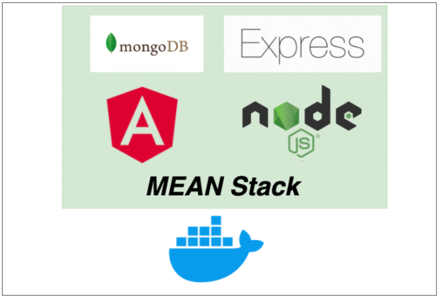
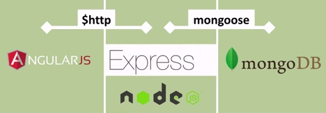
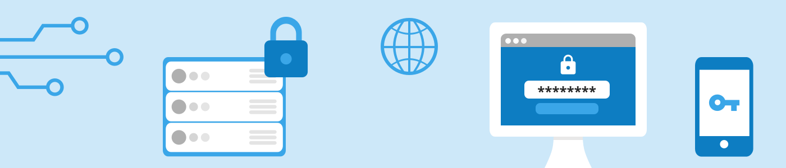
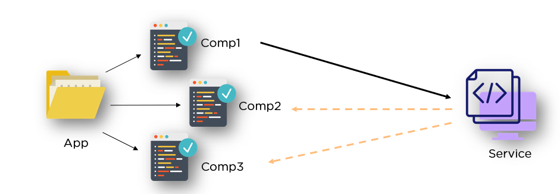
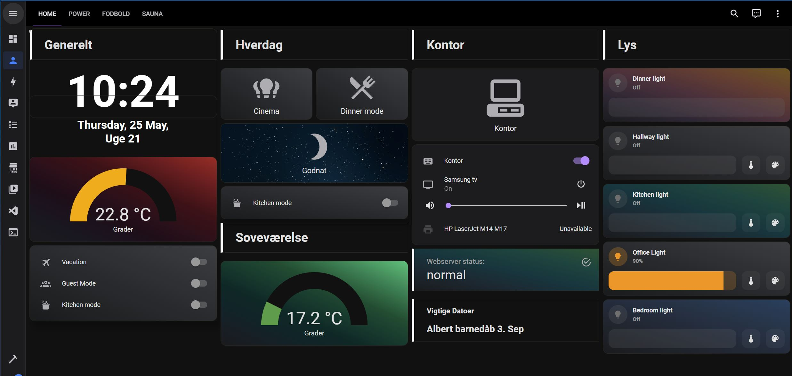

# AngularPlanner

#### MEAN app hosted i Docker Containers .   Kalender og todo system og en generel hub -   til individuel anvendelse med genveje til ofte anvendt materiale under web arbejde.

### Problemformulering: Lave en personlig customized HUB, med daglig anvendte værktøjer. Der kan anvendes som en daglig strukturbog for Web arbejde og IT.
 

## Backend

### Server.js

[Server.js](/server/server.js)

- `express`: Dette er en populær webserver ramme for Node.js.
- `mongoose`: Dette er en Object Data Modelling (ODM) bibliotek til MongoDB og Node.js. Det bruges til at håndtere forbindelsen til MongoDB databasen og gøre forespørgsler til databasen lettere.
- `cors`: Dette er middleware til at aktivere Cross-Origin Resource Sharing (CORS) på serveren.
- `body-parser`: der gør det muligt for serveren at læse og forstå indholdet af indkommende HTTP-anmodninger, specifikt når indholdet er i JSON format.

Efter indlæsning af modulerne, oprettes en ny Express app ved at kalde `express()` funktionen.

## Middleware

Herefter konfigureres forskellige middleware til brug på serveren:

- `body-parser.json()`: Dette middleware anvendes til at parse JSON data fra indkommende anmodninger.
- `cors()`: Dette middleware anvendes til at aktivere CORS på serveren. Konfigurationen tillader anmodninger fra alle oprindelser og forskellige HTTP metoder (GET, POST, PUT, PATCH, DELETE).
- `express.json()`: Dette middleware anvendes til at parse JSON anmodninger.

## Ruter

Serveren indlæser forskellige ruter fra forskellige filer:

- `authdata`: Ruter til at håndtere godkendelsesdata.
- `monthdata`: Ruter til at håndtere data for måneder.
- `shoppingdata`: Ruter til at håndtere indkøbsdata.

Hver rute er tilknyttet en specifik sti på serveren (`/authdata`, `/monthdata`, og `/shoppingdata`).

## MongoDB Forbindelse

Dernæst oprettes forbindelsen til MongoDB databasen. Dette gøres ved hjælp af `mongoose.connect()` funktionen, som tager en forbindelsesstreng som argument. Forbindelsesstrengen er sammensat af miljøvariablen `MONGODB_URL` og databasens navn (`/monthplanner`).

Hvis forbindelsen til databasen oprettes med succes, udskrives en meddelelse i konsollen. Hvis der opstår en fejl under forbindelsesprocessen, fanges denne fejl og udskrives i konsollen.

# Beskrivelse af router fil (Monthdata.js)

## Moduler og Afhængigheder

Først indlæses alle nødvendige moduler og afhængigheder til databasen:

- `dotenv`: Dette modul bruges til at få adgang til miljøvariabler.
- `express`: Dette er en populær webserver ramme for Node.js.
- `mongoose`: Dette er en Object Data Modelling (ODM) bibliotek til MongoDB og Node.js. Det bruges til at håndtere forbindelsen til MongoDB-databasen og definere skemaer for datastrukturer.
- `Schema`: Dette er en del af Mongoose og bruges til at definere skemaer for databasestrukturer.
- `router`: Dette er en del af Express og bruges til at definere og håndtere ruter i API'et.

## Skemaer

Derefter defineres forskellige skemaer til brug i databasen:

- `taskSchema`: Dette er et skema for opgaver.
- `weekSchema`: Dette er et skema for en uge, der indeholder en liste af opgaver for hver dag i ugen.
- `childSchema`: Dette er et skema for børneelementer, der kan bruges i andre skemaer.
- `goalSchema`: Dette er et skema for mål, der indeholder titel, kategori, beskrivelse, vigtighed og fuldførelsesstatus.
- `monthSchema`: Dette er et skema for en måned, der indeholder navn, mål, uger, lærte ting og noter.

## Modeller og Oprettelse

Herefter oprettes modellerne baseret på de definerede skemaer:

- `Month`: Dette er modellen for en måned, der er baseret på monthSchema.

## Generelle Ruter

Derefter defineres generelle ruter til håndtering af månedsdata:

- `GET /`: Denne rute henter alle månedsdata fra databasen.
- `POST /addMonth`: Denne rute tilføjer en ny måned til databasen.

## Mål Ruter

### Tilføjelse af et nyt mål

- **Metode:** `POST`
- **Rute:** `/addGoal/:name`
- **Formål:** Tilføjer et nyt mål til en specifik måned i databasen.
- **Parametre:**
  - `:name` (URL-parameter): Navnet på måneden, hvor målet skal tilføjes.
- **Anmodelsestilstand:**
  - **Body:** Anmodningen skal indeholde følgende data i anmodningslegemet:
    - `monthName` (streng): Navnet på måneden, hvor målet skal tilføjes.
    - `goalData` (objekt): Dataene for det nye mål, herunder titel, kategori, beskrivelse, vigtighed og fuldførelsesstatus.
- **Respons:** Hvis tilføjelsen lykkes, returnerer ruten JSON-data for den opdaterede måned, der inkluderer det tilføjede mål. Hvis der opstår en fejl, returnerer ruten en JSON-meddelelse med fejlinformation.

### Redigering af et specifikt mål

- **Metode:** `PATCH`
- **Rute:** `/updateGoal/:monthName/:goalId`
- **Formål:** Redigerer et specifikt mål baseret på månedens navn og målets ID.
- **Parametre:**
  - `:monthName` (URL-parameter): Navnet på måneden, hvor målet findes.
  - `:goalId` (URL-parameter): ID'et for målet, der skal redigeres.
- **Anmodelsestilstand:**
  - **Body:** Anmodningen skal indeholde følgende data i anmodningslegemet:
    - `goalData` (objekt): Dataene, der skal opdateres for målet, herunder titel, kategori, beskrivelse, vigtighed og fuldførelsesstatus.
- **Respons:** Hvis redigeringen lykkes, returnerer ruten en JSON-meddelelse om, at målet er opdateret, og den opdaterede måned inklusive målet. Hvis målet ikke findes, returnerer ruten en JSON-meddelelse om, at målet ikke blev fundet. Hvis der opstår en anden fejl, returnerer ruten en JSON-meddelelse med fejlinformation.

# Beskrivelse af authdata.js filen

## Moduler og Afhængigheder

Først indlæses alle nødvendige moduler og afhængigheder til databasen:

- `dotenv`: Dette modul bruges til at få adgang til miljøvariabler.
- `express`: Dette er en populær webserver ramme for Node.js.
- `mongoose`: Dette er en Object Data Modelling (ODM) bibliotek til MongoDB og Node.js. Det bruges til at håndtere forbindelsen til MongoDB-databasen og definere skemaer for datastrukturer.
- `bcrypt`: Dette er et bibliotek til hashning af adgangskoder.
- `jsonwebtoken`: Dette er et bibliotek til oprettelse og validering af JSON-webtokens.
- `router`: Dette er en del af Express og bruges til at definere og håndtere ruter i API'et.

## Skemaer og Modeller

Derefter defineres et skema og en model for brugere i databasen:

- `userSchema`: Dette er et skema for brugere, der indeholder email og password felter.
- `User`: Dette er modellen for brugere, der er baseret på userSchema.

## Generelle Ruter

Derefter defineres generelle ruter til håndtering af brugerdata:

- `GET /`: Denne rute henter alle brugerdata fra databasen.
- `POST /login`: Denne rute bruges til at udføre en login-anmodning med brugeroplysninger og generere en JSON-webtoken.
- `POST /createUser`: Denne rute bruges til at oprette en ny brugerkonto i databasen.

Disse ruter giver mulighed for at håndtere brugeroplysninger, herunder login, oprettelse af brugerkonti og hentning af brugerdata fra databasen. Du kan bruge disse ruter til at implementere brugerstyring og godkendelse i din applikation.

## Login System

Der er implementeret et login-system, der styrer adgangen til visse sider i applikationen. Dette opnås ved hjælp af en `AuthGuardService`, der fungerer som en beskyttelsesmekanisme for specifikke ruter. Her er en beskrivelse af de relevante ruter:
  
import { AuthGuardService } from './auth/services/auth-guard.service';

- `/`: Denne rute fører til `DashboardComponent`, der viser instrumentbrættet for din applikation. For at få adgang til denne side skal brugeren være logget ind.

- `/login`: Denne rute fører til `AuthComponent`, der håndterer login-processen.
- `/signup`: Denne rute fører til `SignUpComponent`, der håndterer oprettelse af en ny brugerkonto. For at få adgang til denne side skal brugeren være logget ind.

Denne konfiguration sikrer, at visse sider kun er tilgængelige for brugere, der er logget ind. Hvis en ikke-logget bruger forsøger at få adgang til en beskyttet side, omdirigeres de automatisk til login-siden (`/login`). Når brugeren har logget ind med succes, kan de få adgang til de relevante sider i applikationen.

Du kan tilpasse disse ruter efter behov og definere yderligere beskyttede sider i din applikation ved hjælp af `canActivate`-vagten og `AuthGuardService`.

## AuthGuardService

`private isAuthenticated = false;`

I koden er der oprettet en `AuthGuardService`, der implementerer `CanActivate`-grænsefladen. Denne service bruges som en vagt for at kontrollere adgangen til visse ruter i din Angular-applikation. Her er en beskrivelse af, hvad der sker i `AuthGuardService`:

- `constructor`: I konstruktøren injiceres `AuthServiceService` og `Router` som afhængigheder.
- `canActivate`: Denne metode implementerer logikken for at afgøre, om en bruger har tilladelse til at aktivere en rute. Hvis `this.authService.checkAuthenticated()` returnerer `false`, betyder det, at brugeren ikke er logget ind, og de omdirigeres til login-siden ved hjælp af `this.router.navigate(['/login'])`. Hvis brugeren er logget ind, returneres `true`, og de kan få adgang til ruten.

Denne konfiguration giver mulighed for at kontrollere adgangen til ruter baseret på brugerens loginstatus. Hvis en bruger ikke er logget ind, omdirigeres de automatisk til login-siden, når de forsøger at få adgang til en beskyttet rute.

Du kan tilpasse logikken i `canActivate`-metoden efter behov for at implementere forskellige adgangskontrolregler i din applikation.

## MonthapiService

I koden er der oprettet en `MonthapiService`, der bruges til at håndtere kommunikationen med API'et og håndtere data i forbindelse med måneder. Her er en beskrivelse af, hvad der sker i `MonthapiService`:

- `constructor`: I konstruktøren injiceres `HttpClient` og `GlobalService` som afhængigheder.
- `fetchMonthData`: Denne metode bruger `HttpClient` til at foretage en GET-anmodning til API'et for at hente månedsdataene.
- `setMonthData`: Denne metode modtager dataene som parameter og gemmer dem i `monthdata`-variablen i `MonthapiService`.
- `getMonthData`: Denne metode returnerer de gemte månedsdata fra `monthdata`-variablen.
- `addMonth`: Denne metode bruger `HttpClient` til at foretage en POST-anmodning til API'et for at tilføje en ny måned til databasen.
- `addGoal`: Denne metode bruger `HttpClient` til at foretage en POST-anmodning til API'et for at tilføje et nyt mål til en bestemt måned i databasen.
- `updateGoal`: Denne metode bruger `HttpClient` til at foretage en PATCH-anmodning til API'et for at opdatere et specifikt mål i en bestemt måned i databasen.
- `addNote`: Denne metode bruger `HttpClient` til at foretage en POST-anmodning til API'et for at tilføje en ny note til en bestemt måned i databasen.
- `updateNote`: Denne metode bruger `HttpClient` til at foretage en PATCH-anmodning til API'et for at opdatere en specifik note i en bestemt måned i databasen.
- `addLearned`: Denne metode bruger `HttpClient` til at foretage en POST-anmodning til API'et for at tilføje en ny "Lært" til en bestemt måned i databasen.
- `updateLearned`: Denne metode bruger `HttpClient` til at foretage en PATCH-anmodning til API'et for at opdatere en specifik "Lært" i en bestemt måned i databasen.
- `sendTodo`: Denne metode bruger `HttpClient` til at foretage en POST-anmodning til API'et for at tilføje en ny opgave til en bestemt dag i en måned.
- `updateTodo`: Denne metode bruger `HttpClient` til at foretage en PATCH-anmodning til API'et for at opdatere en specifik opgave i en bestemt dag i en måned.

`MonthapiService`-klassen indeholder metoder, der interagerer med API'et og håndterer dataene i forbindelse med måneder, mål, noter, læring og opgaver. Disse metoder bruges af andre komponenter i din Angular-applikation til at kommunikere med API'et

## Sidestruktur

### `Forside`

Forsiden er ment til at vise et homeassistant system.
Ikke gjort public endnu grundet sikkerhed.

### `Søg data`

Søg blandt data fra alle måneder.

### `Måneder`

Viser data fra hver en måned med individuel data.

### `Shopping`

Kig igennem ting der kan overvejes at købes.

### `Quick Links`

Quick links til ofte anvendte.
